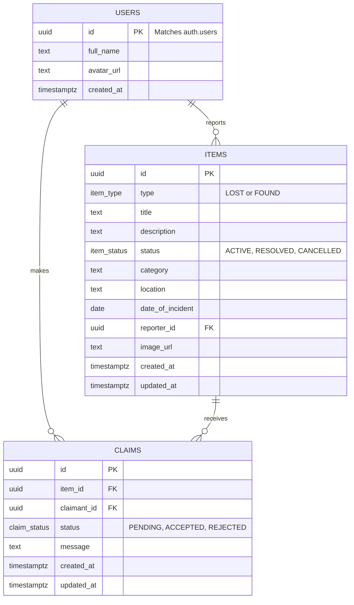

# Lost & Found Platform - Database Design (Supabase / PostgreSQL)

This document details the database schema, entity relationships, and security policies for the Lost & Found platform, utilizing Supabase (PostgreSQL) as the backend.

## 1. Entity Relationship Diagram (ERD)



## 2. Schema Definition & DDL (SQL Scripts)

To initialize the database in Supabase, we define custom ENUM types for state management and then construct the tables.

### A. Custom Types (ENUMs)
```sql
-- Create ENUMs for strict type checking
CREATE TYPE item_type AS ENUM ('LOST', 'FOUND');
CREATE TYPE item_status AS ENUM ('ACTIVE', 'RESOLVED', 'CANCELLED');
CREATE TYPE claim_status AS ENUM ('PENDING', 'ACCEPTED', 'REJECTED');
```

### B. Tables
```sql
-- USERS Table
-- Note: In Supabase, the primary auth is handled in `auth.users`. 
-- This table stores public profile data and links back to the auth system.
CREATE TABLE public.users (
    id UUID PRIMARY KEY REFERENCES auth.users(id) ON DELETE CASCADE,
    full_name TEXT NOT NULL,
    avatar_url TEXT,
    created_at TIMESTAMPTZ DEFAULT NOW()
);

-- ITEMS Table
-- Stores all reported lost and found belongings.
CREATE TABLE public.items (
    id UUID PRIMARY KEY DEFAULT gen_random_uuid(),
    type item_type NOT NULL,
    title TEXT NOT NULL,
    description TEXT NOT NULL,
    status item_status DEFAULT 'ACTIVE' NOT NULL,
    category TEXT,
    location TEXT,
    date_of_incident DATE,
    reporter_id UUID NOT NULL REFERENCES public.users(id) ON DELETE CASCADE,
    image_url TEXT,
    created_at TIMESTAMPTZ DEFAULT NOW(),
    updated_at TIMESTAMPTZ DEFAULT NOW()
);

-- CLAIMS Table
-- Manages the workflow where a user claims an item.
CREATE TABLE public.claims (
    id UUID PRIMARY KEY DEFAULT gen_random_uuid(),
    item_id UUID NOT NULL REFERENCES public.items(id) ON DELETE CASCADE,
    claimant_id UUID NOT NULL REFERENCES public.users(id) ON DELETE CASCADE,
    status claim_status DEFAULT 'PENDING' NOT NULL,
    message TEXT,
    created_at TIMESTAMPTZ DEFAULT NOW(),
    updated_at TIMESTAMPTZ DEFAULT NOW()
);
```

## 3. Row Level Security (RLS) Policies

Supabase uses PostgreSQL RLS to ensure security directly at the database layer. We must enable RLS on all public tables and write policies dictating who can `SELECT`, `INSERT`, `UPDATE`, or `DELETE`.

```sql
-- Enable RLS on all tables
ALTER TABLE public.users ENABLE ROW LEVEL SECURITY;
ALTER TABLE public.items ENABLE ROW LEVEL SECURITY;
ALTER TABLE public.claims ENABLE ROW LEVEL SECURITY;

-- ==========================================
-- POLICIES FOR 'users' TABLE
-- ==========================================

-- 1. Anyone can read public user profiles
CREATE POLICY "Public profiles are viewable by everyone" 
ON public.users FOR SELECT 
USING (true);

-- 2. Users can only insert/update their own profile
CREATE POLICY "Users can insert their own profile" 
ON public.users FOR INSERT 
WITH CHECK (auth.uid() = id);

CREATE POLICY "Users can update their own profile" 
ON public.users FOR UPDATE 
USING (auth.uid() = id);


-- ==========================================
-- POLICIES FOR 'items' TABLE
-- ==========================================

-- 1. Anyone can read ACTIVE items
CREATE POLICY "Active items are viewable by everyone" 
ON public.items FOR SELECT 
USING (status = 'ACTIVE');

-- 2. Authenticated users can insert new items
CREATE POLICY "Authenticated users can create items" 
ON public.items FOR INSERT 
TO authenticated 
WITH CHECK (auth.uid() = reporter_id);

-- 3. Users can only update or delete their own items
CREATE POLICY "Users can update own items" 
ON public.items FOR UPDATE 
USING (auth.uid() = reporter_id);

CREATE POLICY "Users can delete own items" 
ON public.items FOR DELETE 
USING (auth.uid() = reporter_id);


-- ==========================================
-- POLICIES FOR 'claims' TABLE
-- ==========================================

-- 1. Users can insert a claim if they are authenticated
CREATE POLICY "Authenticated users can create claims" 
ON public.claims FOR INSERT 
TO authenticated 
WITH CHECK (auth.uid() = claimant_id);

-- 2. Users can see a claim if they made it, OR if they own the item being claimed
CREATE POLICY "Users can view related claims" 
ON public.claims FOR SELECT 
USING (
  auth.uid() = claimant_id 
  OR 
  auth.uid() = (SELECT reporter_id FROM public.items WHERE items.id = claims.item_id)
);

-- 3. Only the owner of the item can update the claim (to Accept/Reject it)
CREATE POLICY "Item owners can update claim status" 
ON public.claims FOR UPDATE 
USING (
  auth.uid() = (SELECT reporter_id FROM public.items WHERE items.id = claims.item_id)
);
```

## 4. Next Steps for Database Implementation
1. **Supabase Project Creation**: Create a new project in the Supabase Dashboard.
2. **Execute SQL**: Run the generated SQL scripts (DDL and Policies) in the Supabase SQL Editor.
3. **Storage Bucket**: Manually create a public storage bucket named `item-images` via the Supabase dashboard to handle file uploads.
